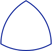

# Lab 2: Circles and Triangles

## Design

### Task 2: Fill the Screen

You will first create a simple circuit that fills the screen. Each column will be a different colour (repeating every 8 columns). Remember that you can only turn on one pixel at a time, so you would need an algorithm similar to this pseudocode:

    for x = 0 to 159:
        for y = 0 to 119:
            turn on pixel (x, y) with colour (x mod 8)

You are to create a circuit that implements the above algorithm. A skeleton file `fillscreen.sv`, and a top-level skeleton `task2.sv`, are in the task2 folder.

The interface to the `fillscreen` module is as follows:

| Signal | Direction | Semantics |
| --- | --- | --- |
| clk       | input  | clock |
| rst_n      | input  | active-low synchronous reset |
| colour    | input  | fill colour (ignored for Task 2) |
| start     | input  | assert to start filling the screen |
| done      | output | goes high once the entire screen is filled |
| vga_*     | output | outputs to the VGA adapter core |

The user of the `fillscreen` module will assert `start` and hold it high until your module
asserts `done`.  Any time after `done` is received, the user may de-assert
`start`. 
After `start` is deasserted, your module should deassert `done` and must be
prepared for the possibility that `start` may be immediately asserted again.

You will need to ignore the `colour` input for Task 2, but it will be useful for the later tasks.

The `task2` module is the toplevel module you will load into the FPGA. It should instantiate the VGA adapter and your `fillscreen` module.
Upon reset (KEY3, active-low, synchronous) and with no other user activity, it should automatically start the process of  filling the entire screen with the colour stripes. This must be finished in 19,210 cycles of CLOCK_50 from the time the reset is _deasserted_, i.e., one cycle per screen pixel plus 10 extra cycles; you will need to finish drawing and then assert `done` at some point within that time budget.

Note that you are using CLOCK_50, the 50MHz clock, to clock your circuit. This is different than Lab 1 where you used a pushbutton switch for your clock.

Exhaustively test your design by writing a testbench and simulating everything in ModelSim (hint: look at the counters first). You will need to demonstrate and submit comprehensive testbenches both for the fillscreen module and the toplevel module, with separate RTL and netlist testbenches.

Make sure your pixel colours are correct. The autograder will compare them against the reference solution.

### Task 3: Bresenham Circle Algorithm

The Bresenham Circle algorithm is an integer-only circle-drawing algorithm. The basic algorithm is described in the following pseudocode (modified from Wikipedia):

    drawCircle(centre_x, centre_y, radius):
        offset_y = 0
        offset_x = radius
        crit = 1 - radius
        while offset_y ≤ offset_x:
            setPixel(centre_x + offset_x, centre_y + offset_y)   -- octant 1
            setPixel(centre_x + offset_y, centre_y + offset_x)   -- octant 2
            setPixel(centre_x - offset_x, centre_y + offset_y)   -- octant 4
            setPixel(centre_x - offset_y, centre_y + offset_x)   -- octant 3
            setPixel(centre_x - offset_x, centre_y - offset_y)   -- octant 5
            setPixel(centre_x - offset_y, centre_y - offset_x)   -- octant 6
            setPixel(centre_x + offset_x, centre_y - offset_y)   -- octant 8
            setPixel(centre_x + offset_y, centre_y - offset_x)   -- octant 7
            offset_y = offset_y + 1
            if crit ≤ 0:
                crit = crit + 2 * offset_y + 1
            else:
                offset_x = offset_x - 1
                crit = crit + 2 * (offset_y - offset_x) + 1

In this task, you are to implement a circuit that draws a circle with its centre at specified coordinates, a specified radius, and a specified colour. The interface to this `circle` module is as follows:

| Signal | Direction | Semantics |
| --- | --- | --- |
| clk       | input  | clock |
| rst_n      | input  | active-low synchronous reset |
| colour    | input  | drawing colour |
| centre_x  | input  | the x-coordinate of the centre |
| centre_y  | input  | the y-coordinate of the centre |
| radius    | input  | the radius in pixels |
| start     | input  | assert to start filling the screen |
| done      | output | goes high once the entire circle is drawn |
| vga_*     | output | outputs to the VGA adapter core |

As with the `fillscreen` module, the user will assert `start` and hold it high until your module asserts `done`.
After `start` is deasserted, your module should deassert `done` and must be
prepared for the possibility that `start` may be immediately asserted again.

Your `circle` module must work for _any_ centre and radius inputs, _including_ centres and radii where parts of the circle would be off the screen (in which case you must draw only the on-screen parts). Any pixels whose coordinates fall outside of the screen area must not be drawn. It must only write pixels on the circle; it must not write other background pixels (i.e., do not fill the screen inside circle).

The clock cycle budget you have for `circle` is the number of pixels that are actually drawn for the circle with the specified radius, plus 10 extra cycles. This budget includes pixels that _would have been_ drawn if the circle fit on the screen. You must assert `done` within the cycle budget to receive full credit.

Upon reset (KEY3, active-low, synchronous) and with no other user activity, your 
top-level module `task3` should fill the screen with black pixels and draw a pure-green circle with the centre at (80,60) and a radius of 40. The clock cycle budget for this is 19,200 plus your `circle` budget plus 10. Note that you must clear the screen to black even if on your board is initially black; the initialization state of circuits cannot in general be relied upon and the autograder will treat the screen as initially undefined. Also note that the autograder will test both your `circle` module with different radii, not just the toplevel.

In designing the datapath for this algorithm, remember that you can only update one pixel per clock cycle. This means that each iteration through the loop should take at most 8 clock cycles to draw one pixel in each octant.

As before, you will need to demonstrate and submit comprehensive testbenches both for the circle module and the toplevel module, separately for RTL and for the netlist.

Be especially careful that your pixel positions are **exactly correct**. The autograder will compare the pixels you output against the reference solution, looking for pixels that overlap, extra pixels, and missing pixels. If you draw a circle in a different place than requested or with an incorrect radius, it is not likely that many pixels will overlap.

### Task 4: The Reuleaux triangle

This task requires you to draw a [Reuleaux triangle](https://en.wikipedia.org/wiki/Reuleaux_triangle). This is a figure similar to a chubby equilateral triangle, where each triangle side is replaced by a section of a circle centred at the opposite corner:

You can think of this figure as the boundary of the intersection of three circles like this:

For the Reuleaux triangle, the _centre_ is defined as the point equidistant from all three corners, while the _diameter_ D is defined as usual as any segment that passes through the centre and whose endpoints lie on the Reuleaux triangle. Observe that this diameter is the same as the length of one side of the inscribed triangle, R1 + R2, and the same as the _radius_ of the three circles used to construct it.

Your job is to write a module which draws this figure with the centre coordinates and the diameter as inputs (pointy end up, as in the figures above). You will probably want to use your circle design and carefully control when the pixels are drawn.

Any fractional coordinates that you may need to compute must be converted to an integer using fixed-point calculations. Because there are different ways to do rounding, you will want to use the same equations as the autograder to compute the location of the three corners:

    assign c_x = centre_x;
    assign c_y = centre_y;
    assign c_x1 = c_x + diameter/2;
    assign c_y1 = c_y + diameter * $sqrt(3)/6;
    assign c_x2 = c_x - diameter/2;
    assign c_y2 = c_y + diameter * $sqrt(3)/6;
    assign c_x3 = c_x;
    assign c_y3 = c_y - diameter * $sqrt(3)/3;

Note that the code given above is not synthesizable. You will have to create a
synthesizable version that produces the exact same results as these equations
under simulation.

Because of potential ambiguity in rounding, there may be pixel errors.  To minimize these on our side,
we will only test your triangle with even diameters.  To minimize these on your
side, be careful when clipping (i.e., omitting portions of the circle when
drawing).  Clipping introduces up to four thresholds for the minimum or maximum
values of x and y.  To reduce errors, choose as few thresholds as needed and reuse
the values already computed as shown above rather than trying to compute any other threshold values.

The interface for module `reuleaux` is the same as the one for `circle` from Task 3, except we specify the _diameter_ of the Reuleaux triangle instead of the radius of the circle.

The clock cycle budget you have for `reuleaux` is the number of cycles that would be required to fully draw all three circles used to construct the Reuleaux triangle, plus 15 cycles; this includes pixels that fall outside of the screen coordinates. The `done` signal that indicates you are finished must be asserted within this budget. (Note that this is _a lot_ more than is needed to draw the actual triangle; you might want to think about how you would do it without wasting cycles on pixels you never draw.)

Upon reset (KEY3, active-low, synchronous) and with no other user activity,
your top-level module `task4` should fill the screen with black pixels and draw
a green Reuleaux triangle with the centre at (80,60) and a diameter of 80. The
cycle budget is 19,200 plus your `reuleaux` budget, plus 10 cycles.

As before, you will need to demonstrate and submit comprehensive testbenches both for the reuleaux module and the toplevel module, both for the RTL and the netlist.

Be especially careful that your pixel positions are **exactly correct**. As with the circle task, the autograder will compare pixel positions against a reference solution.

